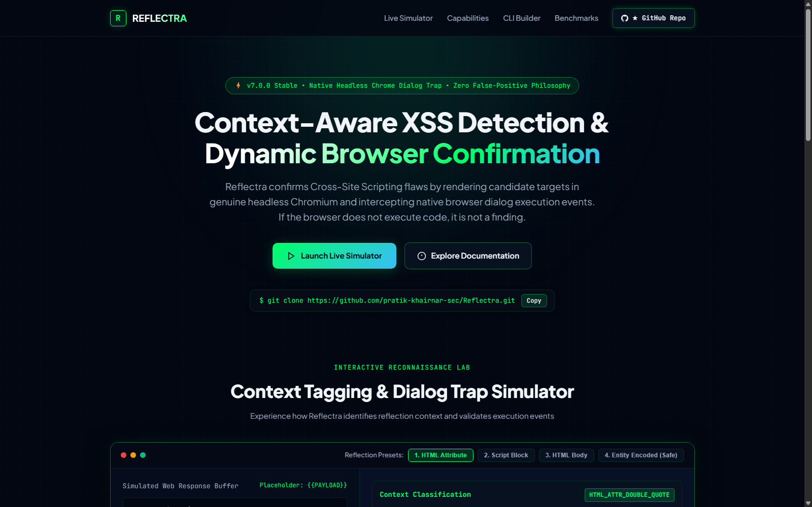
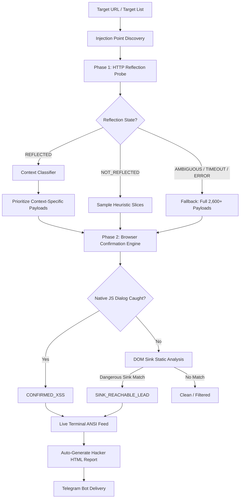

<div align="center">

```text
  ██████╗ ███████╗███████╗██╗     ███████╗ ██████╗████████╗██████╗  █████╗ 
  ██╔══██╗██╔════╝██╔════╝██║     ██╔════╝██╔════╝╚══██╔══╝██╔══██╗██╔══██╗
  ██████╔╝█████╗  █████╗  ██║     █████╗  ██║        ██║   ██████╔╝███████║
  ██╔══██╗██╔══╝  ██╔══╝  ██║     ██╔══╝  ██║        ██║   ██╔══██╗██╔══██║
  ██║  ██║███████╗██║     ███████╗███████╗╚██████╗   ██║   ██║  ██║██║  ██║
  ╚═╝  ╚═╝╚══════╝╚═╝     ╚══════╝╚══════╝ ╚═════╝   ╚═╝   ╚═╝  ╚═╝╚═╝  ╚═╝
```

### Context-Aware XSS Detection & Dynamic Browser Confirmation Framework
**Native Headless Chrome Dialog Confirmation • Reflection Context Tagging • Zero False-Positive Philosophy**

[](https://github.com/pratik-khairnar-sec/Reflectra/releases)
[](https://www.python.org/)
[](https://opensource.org/licenses/MIT)
[](https://github.com/pratik-khairnar-sec/Reflectra/actions)
[](#installation)
[](https://github.com/pratik-khairnar-sec)

[Features](#-key-features) •
[Quick Start](#-quick-start) •
[Architecture](#-architecture--detection-flow) •
[Installation](#-installation) •
[CLI Flags](#-cli-reference) •
[Hacker Reports](#-reporting-experience) •
[Telegram Bot](#-telegram-instant-delivery) •
[Tests](#-testing--validation)

<p align="center" style="margin-top: 15px;">
  <a href="https://pratik-khairnar-sec.medium.com/"></a>
  <a href="https://x.com/PratikSec/status/2108584870293451190"></a>
  <a href="https://pratik-khairnar-sec.github.io/portfolio/"></a>
</p>

<p align="center">
  
</p>

---

</div>

## 📌 Executive Summary

**Reflectra** is an enterprise-grade, context-aware Cross-Site Scripting (XSS) scanner engineered for penetration testers, security researchers, and bug bounty hunters. 

Unlike traditional scanners that rely on naive string pattern matching inside raw HTTP response bodies (which drowns analysts in false positives), Reflectra confirms vulnerabilities by rendering candidate URLs in **real headless Chromium** and trapping the browser's native JavaScript execution event (`alert`, `confirm`, `prompt`). **If the browser doesn't execute JavaScript, it's not a confirmed finding.**

Reflectra combines rapid HTTP reflection probing and intelligent context classification with dynamic headless browser verification, DOM-sink heuristic analysis, blind XSS callbacks, and auto-generated hacker-themed visual reports.

---

## ⚡ Comparison: Reflectra vs Traditional Scanners

| Capability | Naive Regex / Grep Scanners | Traditional Heavy Scanners | Reflectra v7.0.0 |
| :--- | :---: | :---: | :---: |
| **False Positive Rate** | Extremely High (Echo $\ne$ Execution) | Moderate | **Zero (Native JS Dialog Trap)** |
| **Testing Speed** | Fast ($O(N)$ HTTP requests) | Extremely Slow ($O(N \times P)$ Browsers) | **Optimized ($O(1)$ HTTP Pre-probe + Prioritized Browser Pass)** |
| **Context Awareness** | None | Limited | **Full (HTML, Script, Attributes, URI, Comments)** |
| **Fallback Safety** | N/A | Flaky timeouts dropped | **Guaranteed (Network drops fall back to Full 2,600+ Payloads)** |
| **DOM-Sink Analysis** | None | Heavy taint overhead | **Heuristic Sink Probe (`innerHTML`, `eval`, etc.)** |
| **Interactive Wizard** | ❌ | ❌ | **✅ Built-in 6-Step Smart Wizard** |
| **Instant Exfil / Alerts** | ❌ | ❌ | **✅ Telegram Bot Delivery + Auto-Reports** |
| **Modern Packaging** | Manual script | Often broken setup | **`pip install .` + `reflectra` command** |

---

## 🚀 Key Features

* **Real Browser Dialog Trapping**: Uses Selenium + Headless Chrome to confirm execution via native JavaScript alert/confirm/prompt intercepts.
* **Smart Phase-1 Context Probing**: Sends benign unique markers over lightweight HTTP to identify exact reflection context (HTML body, double-quoted attribute, single-quoted attribute, unquoted attribute, script block, URI parameter, or comment).
* **Context-Driven Prioritization**: Moves payloads tailored for the detected context to the front of the queue, drastically shortening time-to-first-bug.
* **Strict Fallback Guarantee**: If a target returns ambiguous reflection or experiences network hiccups (`TIMEOUT`, `CONNECTION_ERROR`, `HTTP_ERROR`), Reflectra **never** marks it safe. It automatically runs the complete, unpruned 2,600+ payload catalog.
* **Interactive One-Click Wizard**: Run `reflectra` with no arguments for a streamlined interactive experience with intelligent defaults.
* **Stop-on-First-Confirmed / Throttling**: Configure `--max-confirmed N` (or `--stop-on-first-confirmed`) to save time and bandwidth once a parameter is proven vulnerable.
* **DOM-Sink Lead Identification**: Analyzes DOM sinks (`innerHTML`, `outerHTML`, `document.write`, `eval`, `setTimeout`) when dialogs don't fire due to CSP or missing triggers.
* **Authenticated Security Scans**: Seamless session handling with `--cookie` and repeatable `--header` passed both to HTTP probes and headless browser drivers.
* **Out-of-Band Blind XSS**: Inject blind XSS payloads into all endpoints targeting Burp Collaborator, Interactsh, or self-hosted XSS Hunter instances.
* **Interactive Hacker-Themed HTML Reports**: Beautiful dark terminal/CRT UI grouping findings by bug class with clickable PoCs and one-click payload copy buttons.
* **Telegram Bot Integration**: Delivers scan summaries and attaches report files directly to your private channel or bot chat upon scan completion or `Ctrl+C`.

---

## 🎯 Architecture & Detection Flow



---

## 💻 Quick Start

### 1. The Interactive Wizard (Recommended)
Run without arguments to launch the guided wizard. Just press `Enter` to accept defaults:

```bash
reflectra
# or
python3 -m reflectra
# or
python3 reflectra.py
```

```text
========================================================================
                      Reflectra v7.0.0
               Context-Aware XSS Scanner (Wizard)
========================================================================

[1/6] Target URL or file: https://target.tld/search?q=test
[2/6] Worker threads [default: 5]: 10
[3/6] Session cookie (leave empty if unauthenticated): session=xyz123
[4/6] Stop after N confirmed findings [default: 5]: 3
[5/6] Send blind XSS payloads? [y/N]: N
[6/6] Deliver report to Telegram? [y/N]: y

[i] Loaded 1 target(s), 2605 payload(s)
[i] Probing https://target.tld/search?q=test
[+] Parameter 'q' reflected in: HTML_TEXT_CONTEXT
[!] CONFIRMED XSS on https://target.tld/search?q=%3Cscript%3Ealert%281%29%3C%2Fscript%3E
[i] Report saved to ./reports/reflectra_target-tld_20261005-151000.html
[i] Telegram summary delivered.
```

---

## 🛠️ Installation

### Option A: Standard Pip Install (Recommended)

```bash
git clone https://github.com/pratik-khairnar-sec/Reflectra.git
cd Reflectra
pip install -r requirements.txt
pip install .
```
Now you can run `reflectra` anywhere from your terminal!

---

### Option B: Kali Linux / Debian / Ubuntu (`.venv`)

```bash
# 1. Install system dependencies & Chromium driver
sudo apt update && sudo apt install -y chromium chromium-driver python3-venv git

# 2. Clone and enter repository
git clone https://github.com/pratik-khairnar-sec/Reflectra.git
cd Reflectra

# 3. Create virtual environment
python3 -m venv .venv
source .venv/bin/activate

# 4. Install Reflectra
pip install -r requirements.txt
pip install -e .

# 5. Verify installation
reflectra --version
```

---

### Option C: Windows Setup (PowerShell)

```powershell
# 1. Clone repository
git clone https://github.com/pratik-khairnar-sec/Reflectra.git
cd Reflectra

# 2. Create and activate virtual environment
py -m venv .venv
.\.venv\Scripts\Activate.ps1

# 3. Install dependencies
pip install -r requirements.txt
pip install -e .

# 4. Verify installation
reflectra --version
```
> **Note**: Ensure Google Chrome is installed. `webdriver-manager` automatically manages the appropriate ChromeDriver binary.

---

## 📖 Practical Usage Examples

### 1. Basic Single-Target Scan
```bash
reflectra -u "https://example.com/search?q=test"
```

### 2. Multi-Target Scan with HTML Report & Concurrency
```bash
reflectra -f urls.txt -t 15 -o report.html
```

### 3. Authenticated Vulnerability Assessment
```bash
reflectra -u "https://example.com/profile?name=admin" \
    --cookie "session=eyJhbGciOi...; role=admin" \
    --header "X-Requested-With: XMLHttpRequest"
```

### 4. Fast Triage Mode (Stop on First Confirmed Finding)
```bash
reflectra -u "https://example.com/view?id=123" --stop-on-first-confirmed
```

### 5. Prioritize Context with Capped Payloads
```bash
reflectra -u "https://example.com/catalog?item=1" --max-payloads-per-point 100
```

### 6. Out-of-Band Blind XSS Injection
```bash
reflectra -f targets.txt --blind-url "https://my-id.xss.report" --blind-only
```

### 7. Automated Telegram Notification
```bash
reflectra -u "https://example.com/search?query=x" \
    --telegram-token "123456:ABC-DEF..." \
    --telegram-chat-id "987654321" \
    -o report.html
```
*(Credentials are encrypted and securely cached in `~/.reflectra/config.json` after the first successful delivery; subsequent runs deliver automatically!)*

---

## ⚙️ CLI Reference

```text
usage: reflectra [-h] [-u URL] [-f FILE] [-p PAYLOAD] [-t THREADS] [--timeout TIMEOUT]
                 [--max-payloads-per-point N] [--no-context-filter] [--no-sink-probe]
                 [--skip-unreflected] [--max-confirmed N] [--stop-on-first-confirmed]
                 [--cookie COOKIE] [--header HEADER] [--insecure]
                 [--blind-url BLIND_URL] [--blind-only]
                 [-o OUTPUT] [--report-style {default,hacker}] [--plain]
                 [-v] [--no-banner] [--version]
                 [--telegram-token TELEGRAM_TOKEN] [--telegram-chat-id TELEGRAM_CHAT_ID]
                 [--forget-telegram] [--wizard]

Target Selection:
  -u, --url URL                Single target URL to scan
  -f, --file FILE              File of target URLs, one per line

Scan Tuning:
  -p, --payload PATH           Payload file or single literal payload (default: reflectra/payloads/xss.txt)
  -t, --threads N              Concurrent browser worker threads (default: 5)
  --timeout SECONDS            Seconds to wait for a JS dialog before timing out (default: 2.0)
  --max-payloads-per-point N   Cap payloads per injection point (0 = no cap, full original coverage)
  --no-context-filter          Skip phase-1 HTTP reflection probe; run full brute-force
  --no-sink-probe              Disable DOM-sink static analysis on non-firing payloads
  --skip-unreflected           Don't sample unreflected parameters (faster, may skip client-side DOM XSS)
  --max-confirmed N            Stop scanning after N confirmed XSS findings
  --stop-on-first-confirmed    Shorthand alias for --max-confirmed 1

Authentication:
  --cookie COOKIE              Cookie header string, e.g. "session=abc; role=user"
  --header HEADER              Extra HTTP header 'Name: value' (repeatable)
  --insecure                   Disable TLS certificate verification

Blind & Stored XSS:
  --blind-url URL              External OOB collector URL (Interactsh, Burp, xss.report)
  --blind-only                 Fire blind payloads over HTTP and skip browser confirmation

Reporting & Output:
  -o, --output PATH            Report file path (.html, .json, .txt). Defaults to ./reports/
  --report-style {default,hacker}
                               HTML report styling. 'hacker' = Dark CRT Theme with grouped bug classes
  --plain                      Disable ANSI colors and banners in terminal output
  -v, --verbose                Enable verbose debug logging
  --no-banner                  Suppress ASCII art header
  --version                    Show tool version and exit

Telegram Delivery:
  --telegram-token TOKEN       Telegram bot token from @BotFather
  --telegram-chat-id CHAT_ID   Telegram chat/channel ID for instant report delivery
  --forget-telegram            Erase locally saved Telegram credentials

Interactive Mode:
  --wizard                     Force interactive guided mode
```

---

## 📊 Reporting Experience

### 1. Live Terminal Feed
Findings are streamed to stdout in real time as workers execute:
* 🟢 **Green**: `CONFIRMED_XSS` (Native dialog caught)
* 🟡 **Yellow**: `SINK_REACHABLE_LEAD` (DOM sink reachable, manual inspection required)
* 🔵 **Cyan**: `BLIND_INJECTION` (Payload delivered to external callback collector)
* 🔴 **Red**: `ERROR` (Worker or network failure)

### 2. Hacker-Themed Interactive HTML Report
Passing `-o report.html` (or letting Reflectra auto-save into `./reports/`) creates an interactive report:
* **Dark CRT/Cyberpunk Aesthetics** with neon classification badges.
* **Grouped by Bug Class**: Script Context, HTML Context, Attribute Context, URI Context, DOM Sinks, and Blind Injection.
* **Proof-of-Concept Links**: Every finding is an active clickable hyperlink to immediately reproduce in your browser.
* **One-Click Payload Copy**: Instantly copy exact payloads to your clipboard for bug bounty ticket submission.
* **Toggle View**: Switch between grouped card layout and searchable flat table.

---

## 📡 Telegram Instant Delivery

Keep your scans running on a remote VPS and get alerted the second findings are identified.

```bash
reflectra -u "https://example.com/page?id=1" \
    --telegram-token "612345678:AAH..." \
    --telegram-chat-id "123456789"
```

1. Create a bot using [@BotFather](https://t.me/BotFather) and receive your token.
2. Send `/start` to your bot.
3. Fetch your Chat ID using `https://api.telegram.org/bot<TOKEN>/getUpdates`.
4. Run Reflectra once with both arguments. They will be saved to `~/.reflectra/config.json`.
5. On completion or `Ctrl+C`, Reflectra sends a clean summary and attaches the full report file.

---

## 🧪 Testing & Validation

Reflectra comes with a comprehensive automated test suite consisting of **45 tests** across unit tests and non-mocked integration tests against a deterministic local vulnerable test harness (`tests/fixtures/fixture_server.py`).

```bash
# Run complete test suite
python -m pytest tests/test_unit.py tests/test_integration_probe.py -v
```

### Verified Test Matrix
* ✅ **URL & Parameter Handling**: Synthetic parameter creation, fragments, and URL encoding validation.
* ✅ **Reflection Classification**: Accurate identification of HTML text, attribute context, and script tags.
* ✅ **Fallback Safety Guarantees**: Asserts that `TIMEOUT`, `CONNECTION_ERROR`, and `HTTP_ERROR` outcomes always receive the full 2,600+ payload list.
* ✅ **Browser Driver Stability**: Driver pool reuse, crash isolation, and alert/confirm/prompt handling.
* ✅ **Stop Triggers**: Threshold assertion for `--max-confirmed` and `--stop-on-first-confirmed`.
* ✅ **Report Sanitization**: Slugification of target hostnames and resilient auto-naming.

---

## ⚖️ Responsible Use & Legal Disclaimer

Reflectra is strictly intended for **authorized penetration testing**, **security audits**, **bug bounty research**, and **educational purposes**.

> [!CAUTION]
> Scanning targets without prior explicit written permission is strictly illegal and violates the Computer Fraud and Abuse Act (CFAA), the Computer Misuse Act, and international cyber legislation. The author assumes no liability and is not responsible for any misuse or damage caused by this utility. Always stay within defined scope.

---

## 👤 Author & Support

* **Maintainer**: **Pratik Khairnar**
* **GitHub**: [@pratik-khairnar-sec](https://github.com/pratik-khairnar-sec)
* **Email**: `pratik.khairnar.sec@gmail.com`
* **Specialization**: Web Application Security, Bug Bounty, Automated Security Engineering

If you find Reflectra valuable, please consider giving the repository a ⭐️ **Star** on GitHub!

---

## 📄 License

This project is licensed under the **MIT License** — see the [LICENSE](LICENSE) file for complete details.
